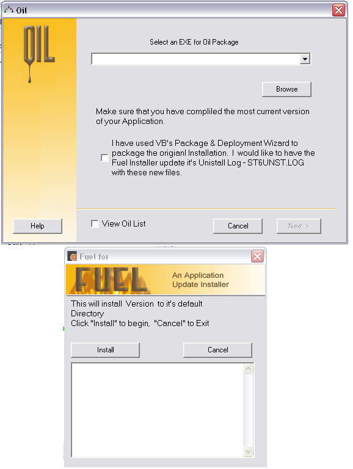

## FuelOil

### Description

FuelOil is a two part Application Update Creator and Installer for VB6. Fuel is the Installer, Oil the update package creator.

What does Oil do?

Uses a complied executable to create an update installation package

Finds the executable's File name and version

Allows for entry of new files required for the update.

Allows for creation of new folders/directories.

Allows for new files to be .zip compressed

Allows for update to the uninstall log - ST6UNST.LOG, for VB's P&D wirard

Creates an install ini file that the Fuel install reads.

Copies any new files and the Fuel installer to the package folder.

What does the Fuel installer do?

Reads the install.oil (ini file)

Finds the Application to update's path

Finds the Windows System Dir.

Determines what files to install and where they go.

Installs the files, downloads then if needed.

Registers any System files (ocx,dll)

Updates the uninstall log - ST6UNST.LOG, if selected to.

This is an updatefor my submission UpdateInstaller
 
### More Info
 

             |
---                |---
**Submitted On**   |2003-12-02 13:07:04
**By**             |[cdevos](https://github.com/Planet-Source-Code/PSCIndex/blob/master/ByAuthor/cdevos.md)
**Level**          |Intermediate
**User Rating**    |5.0 (10 globes from 2 users)
**Compatibility**  |VB 6\.0
**Category**       |[Complete Applications](https://github.com/Planet-Source-Code/PSCIndex/blob/master/ByCategory/complete-applications__1-27.md)
**World**          |[Visual Basic](https://github.com/Planet-Source-Code/PSCIndex/blob/master/ByWorld/visual-basic.md)
**Archive File**   |[FuelOil1679241222003\.zip](https://github.com/Planet-Source-Code/cdevos-fueloil__1-50267/archive/master.zip)

